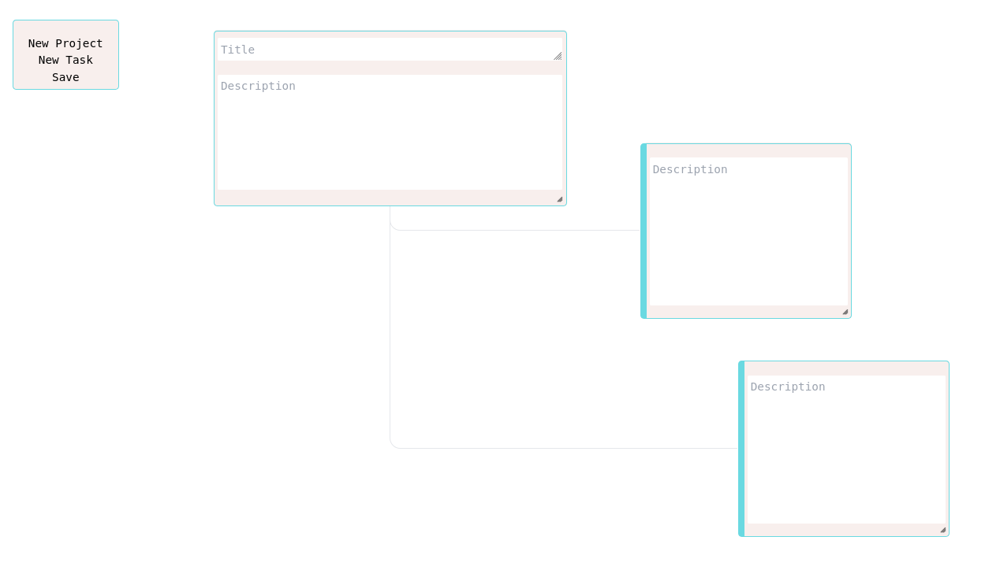

## Simple note taker app

This is a simple note taker app that allows you to create, read, update and delete notes. It is built using just jQuery and tailwindcss.

## Loading the app
Just open the 'notes.html' file in your browser.

## Features
- Project notes: titles and descriptions
- Task notes: description only
- Connect notes: press CTRL and click on a note to connect it to another note
- Delete notes: press DELETE to delete a note
- Save the webpage to keep your notes# agents_coordinator
